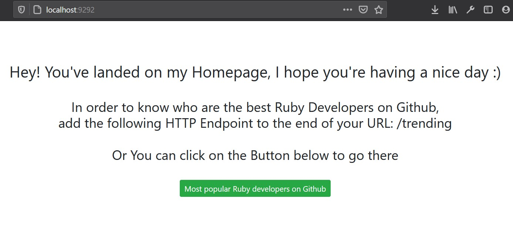
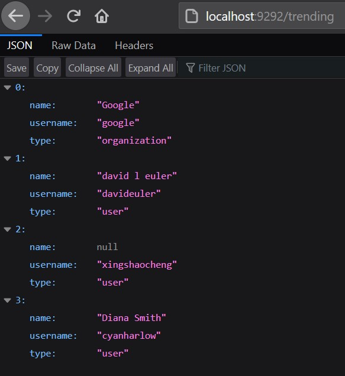

# ruby-trending_developers

A simple Sinatra HTTP API example, which returns the most popular Ruby developers on Github by adding the Endpoint **/trending** to the end of the URL.
The return format is JSON.
The response is going to have the following format:
```
[
  {
    "name": "Mike Perham",
    "username": "mperham",
    "type": "user"
  },
  ...
]
```
The app is based on `github-trending-api` project. For further informations see https://github.com/huchenme/github-trending-api

## Installing Ruby and Sinatra
Install Ruby on your system by typing `sudo apt-get install ruby-full` in your terminal.
Check if Ruby was installed on the system using: `ruby -v`.
This should output some information about the installed Ruby version.

### Installing Sinatra
Just as you would install any other gem, Sinatra is installed like so:
`gem install sinatra`

## Running the App
You have to options in order to run the application:
1. Either by typing `rackup` in the terminal, after changing directory to that file.
2. Or by compiling the **app.rb** by typing `ruby app.rb`.


The App is now up and running on your **localhost** address and on the default Sinatra port **9292**.
Right now you'll need to enter the following URL in the addressbar of your favourite browser: `http://localhost:9292/`. This will land you on the Homepage of my app.
Another easier way is to click on the button shown in the Homepage to take you over there.

<div align="center">
  
  <br>
</div>

### Checking trending Ruby developers
In order to check trending Ruby developers on Github hock `/trending` at the end of the URL or re-type it in the addressbar: `http://localhost:9292/trending`.
Here you can see a test sample of printed JSON data.

<div align="center">
  
  <br>
</div>

#### Note
As long as the API-server of development down, this app is going to print out a Test-API sample made by the same developer of `github-trending-api`.
When the dev-server is up again, You're going to get back the daily trending Ruby developers on Github. Stay tuned!
